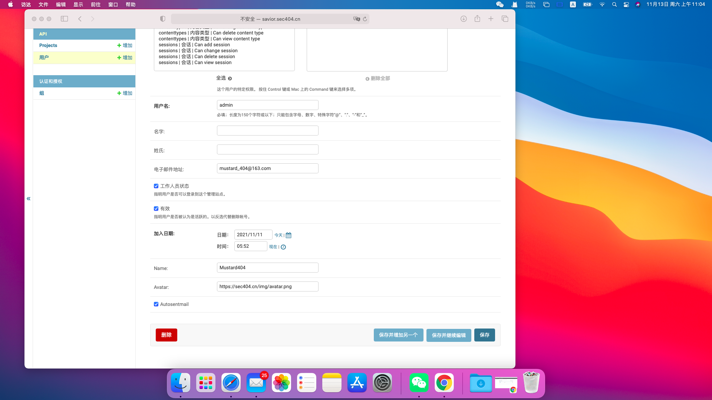
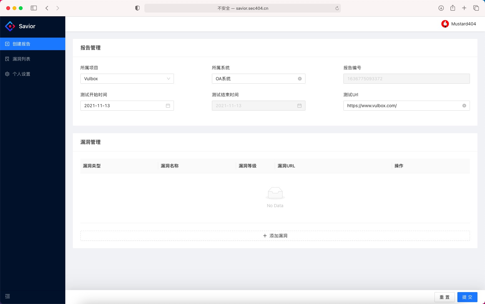
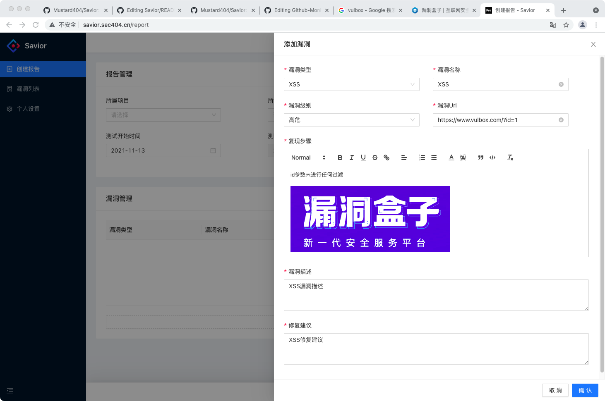
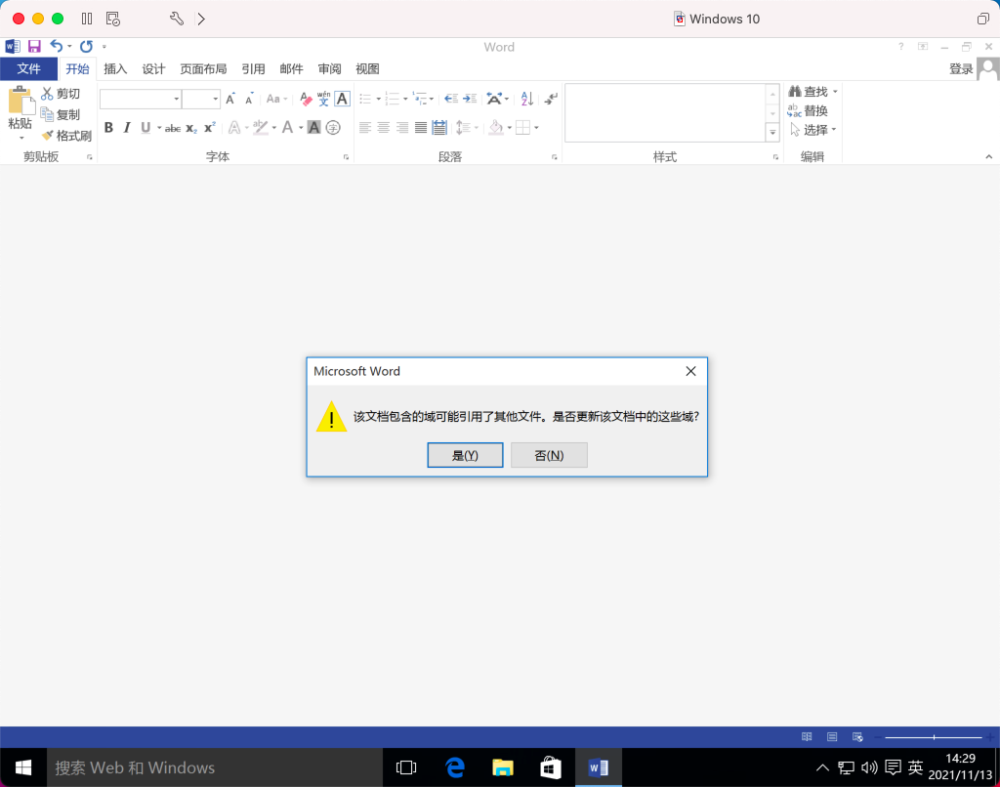
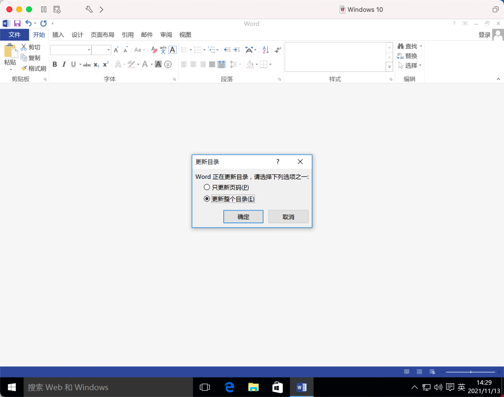
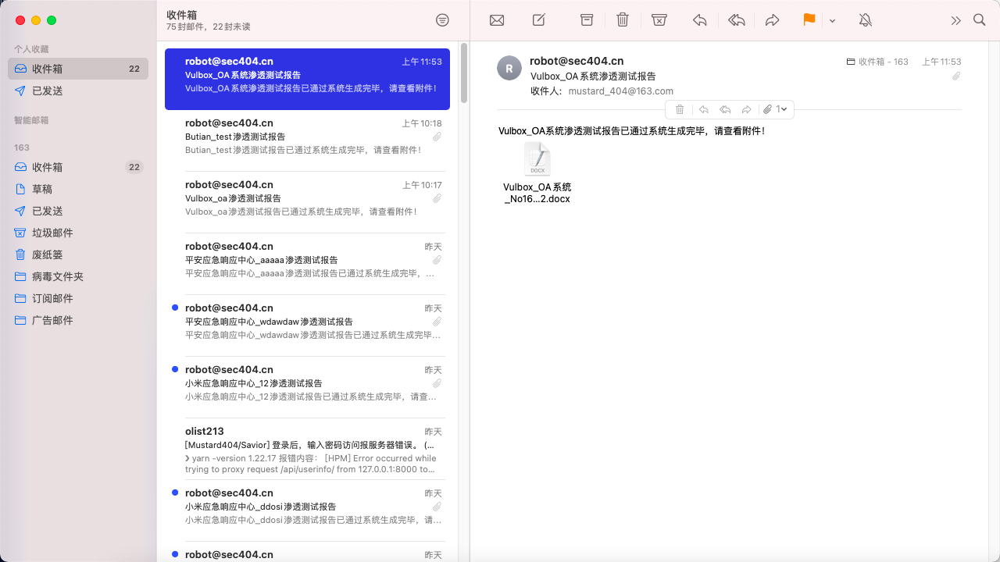
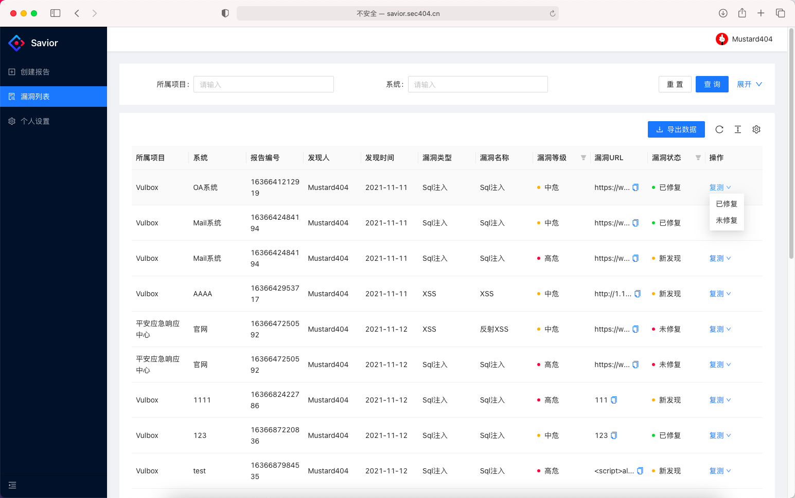
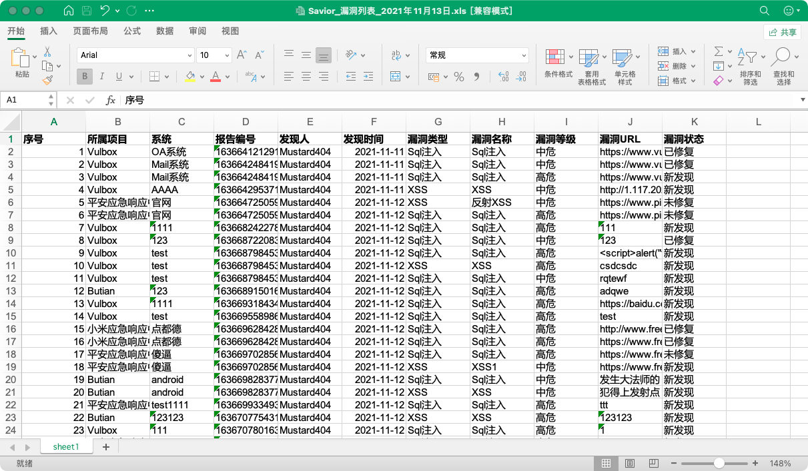

<div align="center">

# 🍋 Savior 渗透测试报告自动生成工具  

[](./LICENSE)
[](https://www.python.org/)
[](https://www.docker.com/) 
[](https://github.com/Mustard404/Savior/) 
[](https://github.com/Mustard404/Savior/)

 </div>
 
##  😘方便的话麻烦各位老板给个😘star!

##  🛠 作者

**Mustard404**    
[https://sec404.cn](https://sec404.cn)  

## 🎈 背景

在安服仔的日子里，发现下面的人输出的渗透测试报告结果不规范，主要在报告质量、内容、字体、及修复方案中存在诸多问题，而且大部分安服仔需要对每次的项目结果进行统计整理，方便后续跟踪复测。  
因此研发了Savior-渗透测试报告辅助生成系统，起这个名字也是为了拯救大多数逗逼渗透测试工程师，告别繁琐的渗透测试报告编写过程及漏洞统计过程。  
这是一个菜狗🐶通宵一年写的菜鸡🐔项目。。。 

## ⏰ 系统框架

- **前端**：Ant Design Pro  
- **后端**：Django REST Framework  
- **数据库**：Mysql  

## 🍙 主要功能

- **用户管理：** 主要是方便统计漏洞的发现者，后续可能大概也许会添加漏洞统计模块，根据提交数据、漏洞类型、时间等进行统计报表，当前用户管理模块仅允许通过Django后台进行修改，前端只负责展示，主要是我太懒了。。。
- **项目管理：** 根据项目的不同可上传项目的专属渗透测报告模板，并可以根据需要进行模板自定义模板（/Demo/demo.docx）；
- **模板自定义：** 不用修改源代码，仅需修改word即可进行模板自定义；
- **整改建议管理：** 此平台主要就是为了体现标准化输出，因此可通过内置漏洞描述及修复建议进行快速输出，并支持自定义修改（/Demo/常规WEB渗透测试漏洞描述及修复方法.docx）；
- **一键生成：** 通过提交报告模块，内联项目模板，快速生成渗透测试报告，真正达到了一键生成，并确保报告内数据准确、字体统一、格式标准；
- **自动邮件：** 在生成报告后可通过用户管理配置的自动邮件发送功能进行邮件通知，可自定义邮件模板，这样再报告给客户的时候就可以直接转发了（暖男功能）；
- **漏洞统计：** 每次渗透过后，需要挨个查找报告进行统计整理，现在只要提交报告后，后台会自动联动；
- **漏洞报表一键导出** 
- **漏洞跟踪：** 增加了漏洞状态字段，创建报告后，漏洞状态默认为新增，漏洞管理模块可进行复测，包括已整改、未整改两种状态；

## 🚗 相关预览

**Demo：** [http://savior.sec404.cn](http://savior.sec404.cn)   
**演示账号：** admin  
**演示密码：** Savior@404   

## ✨ 安装指南

首先将代码clone到本地：  
```
git clone https://github.com/Mustard404/Savior.git
``` 

### Docker部署

我们推荐使用Docker进行部署，相对于源码部署更为简单和快速。  

部署前请务必先安装**Docker**及**docker-compose**。  

修改配置文件  
首先复制根目录的.env.docker并重命名为.env，修改其中的Email Settings和initial Administrator配置。这两个配置分别控制邮件提醒，以及初始管理帐号密码及邮箱。 同时需要注意以下两点： 
 
- 务必把邮箱修改为自己邮箱，不然可能会出现非预期错误！  
- 如果使用阿里云、腾讯云服务器，请使用smtp的ssl协议，两家云厂商默认封禁了25端口。

一键启动  
```
docker-compose up -d 
```    

访问 [http://127.0.0.1:8000](http://127.0.0.1:8000)  即可看到页面。  

修改启动端口  
如果想修改启动端口，可以修改docker-compose.yaml文件中web容器的ports。 默认为8000:8000，比如要修改为8080端口可改为8080:8000。  

不知道为啥好多人部署出现登入500错误，请一定要检查邮箱配置正确！！！！！！！    

Bilibili视频教程如下：  

[https://www.bilibili.com/video/BV1QL4y1v7gg?share_source=copy_web](https://www.bilibili.com/video/BV1QL4y1v7gg?share_source=copy_web)

### 源码部署

所需环境：

- python 3.8+(测试过3.6也没问题，其他版本自行测试)
- yarn 1.22+
- [Pandoc](https://www.pandoc.org/installing.html)
- Mysql 5.7

前端环境  
```
cd app  
yarn && yarn start:no-mock
``` 
环境变量设置
创建字符集为utf-8编码的数据库。
复制**.env.docker**为**.env**，并配置数据库、邮箱、管理员等信息。

- 务必把邮箱修改为自己邮箱，不然可能会出现非预期错误！  
- 如果使用阿里云、腾讯云服务器，请使用smtp的ssl协议，两家云厂商默认封禁了25端口。

后端环境  
```
#开启env环境
python3 -m venv env
source env/bin/activate
#安装依赖
python -m pip install -r requirements.txt -i http://pypi.doubanio.com/simple --trusted-host pypi.doubanio.com 
#同步数据库
python manage.py makemigrations api
python manage.py migrate
python manage.py init_admin
#启动后端
python manage.py runserver 0.0.0.0:8000
```  
源码部署环境：

- **前台页面：** [http://127.0.0.1:8001](http://127.0.0.1:8001)

- **Django管理后台：** [http://127.0.0.1:8000/api/admin/](http://127.0.0.1:8000/api/admin/)

## 📦 使用手册

### 初始化说明

其中Savior平台包含两个后台页面。考虑到安全性，目前用户管理、项目管理托管于Django管理后台（主要是这两个模块不会写），其余功能均可通过前台页面实现。  

- **前台页面：** [http://127.0.0.1:8000](http://127.0.0.1:8000)

- **Django管理后台：** [http://127.0.0.1:8000/api/admin/](http://127.0.0.1:8000/api/admin/)

#### 用户管理

访问Django管理后台：[http://127.0.0.1:8000/api/admin/](http://127.0.0.1:8000/api/admin/), 请完善API>用户的Name、Avatar、Autosentmail三个字段，分别控制报告的作者、头像（图片Url）、生成报告后自动发送渗透测试报告到邮箱。
  
  
  
#### 项目管理

访问Django管理后台：[http://127.0.0.1:8000/api/admin/](http://127.0.0.1:8000/api/admin/)，请通过API>Projects进行添加项目，可根据不通项目选择不通的渗透测试报告模板。参数说明：Project logo（项目Logo）、Project center（项目名称）、Project description（项目描述）、Project template（渗透测试报告模板，目前标准模板可使用Demo/demo.docx，如需自定义模板，请参考*模版自定义*部分） 
  
 

#### 整改设置

访问[http://127.0.0.1:8000](http://127.0.0.1:8000) 可进入Savior平台，通过个人设置>整改设置>添加漏洞模板可进行设置漏洞类型、漏洞描述、修复建议从而达到标准化。目前整理了一些通用的修复建议模板，请参考Demo/常规WEB渗透测试漏洞描述及修复方法.docx。  

  

#### 模板自定义

目前根据我经常使用的渗透测试报告模板生成了一个demo版本（请参考/Demo/demo.docx）。当然您也可以根据自己的需求进行模板自定义，其中仅需在WORD模板中进行参数替换，目前Savior中具体参数如下：  

- {{report_no}} - 漏洞编号，通过时间戳自动生成，确保漏洞编号的唯一性  
- {{report_center}} - 测试项目，为项目管理中项目名称  
- {{report_systemname}} - 系统名称  
- {{report_start_time}} - 测试开始时间    
- {{report_end_time}} - 测试结束时间    
- {{report_author}} - 测试提交人，对应用户管理的Name参数    
- {{report_test_url}} - 测试Url 
- {{vuls|length}} - 漏洞个数 
- {{vuls|vul_statistics(3)}} - 高危漏洞个数
- {{vuls|vul_statistics(2)}} - 中危漏洞个数
- {{vuls|vul_statistics(1)}} - 低危漏洞个数
- 紧急状态紧急状态严重状态严重状态良好状态预警状态 - 整体风险评级 感谢[decadecaomm](https://github.com/decadecaomm)提供相关逻辑  

- 以下漏洞详情请利用进行循环遍历。如想列出所有漏洞URL,则使用参数{{item.vul_url}}      

- {{item.vul_url}} - 漏洞Url  
- {{item.vul_recurrence}} - 漏洞复现  
- {{item.vul_level}} - 漏洞危险等级 
- {{item.vul_describe}} - 漏洞描述  
- {{item.vul_modify_repair}} - 修复建议 

**注：** Savior平台渗透测试模板遵循Jinja2语法，更多内容请参考[https://jinja.palletsprojects.com/en/3.0.x/](https://jinja.palletsprojects.com/en/3.0.x/)

### 创建报告

如果我们完善了用户信息、项目管理、整改设置后，就可以通过前端页面进行创建报告，其大概流程如下： 
首先完善报告的基本信息。  

  
 
选择漏洞管理的添加漏洞功能。选择漏洞类型后，漏洞名称、漏洞描述、修复建议会根据整改设置进行自动联动，并可根据需求进行自定义修改。需要注意的是漏洞详情处如果需要插入XSS语句，请进行url编码后进行输入！如果想插图，请使用微信/QQ的截图快捷键，然后ctrl+v粘贴即可！     

  

**注：** 未提交前请勿刷新页面，此时漏洞详情保存为前端。提交后会自动生成渗透测试报告并进行下载。  

  

打开报告会提示更新域，更新请选择是，再选择更新整个目录，此问题主要是为了更新目录，不然渗透测试报告中目录无法自动更新。  

  


  

如果在用户管理打开了Autosentmail功能，渗透测试报告会自动发送至我们邮箱，方便转给甲方爸爸。  

 

### 漏洞列表

访问Savior平台，选择漏洞列表可进行漏洞统计并进行漏洞复测。其中漏洞包含三个状态（新发现、已修复、未修复）  

  

通过选择导出数据功能，可将漏洞列表导出为Excle。  

 

## 常见问题

- Q：重启容器后，账户丢失。

A：需要docker exec到容器内，修改/Savior/docker/run.sh，按照以下方式将部分代码注释掉。
```
#!/bin/bash
/bin/bash /Savior/docker/wait-for-it.sh -t 0 mysql:3306
export PYTHONPATH=/Savior/
#python3 /Savior/manage.py makemigrations api
#python3 /Savior/manage.py migrate
#python3 /Savior/manage.py init_admin
supervisord -n
```
- Q：Docker部署后，出现登入500错误。

A：检查.env文件是否创建，并核查邮箱配置是否正确。如果使用云服务器，请务必使用smp的SSL协议端口。

- Q：生成报告后，漏洞复线内容为空。

A：根据反馈大部分情况是因为使用了WPS导致，建议使用Office 2013版本以上。

## 致谢

- 感谢 [echo503](https://github.com/echo503) 提供的项目帮助   
- 感谢 [lp0int](https://github.com/lp0int) 提供的项目帮助   
- 项目框架及Docker部署参考[Github-Monitor](https://github.com/VKSRC/Github-Monitor) 

## 后续升级计划

- 用户管理、项目管理迁移至前端  
- 大数据看板

## 其它说明

此项目为开源项目，如果想进行商业利用，请进行留言联系。  

## 其它帮助

如果在此项目上存在问题，请加入以下微信群进行寻求帮助。 


## 老年防痴呆专用

### 漏洞修复建议导出
```
docker exec -it savior_mysql_1 /bin/bash 
mysqldump -u root -p  savior api_program > api_program.sql; 
#输入密码，默认Savior@404 
exit 
docker cp   savior_mysql_1:/api_program.sql ~ 
```
### 漏洞修复建议导入
```
docker cp Demo/api_program.sql savior_mysql_1:/
mysql -u root -p 
#输入密码，默认Savior@404 
use savior; 
source /api_program.sql; 
```
